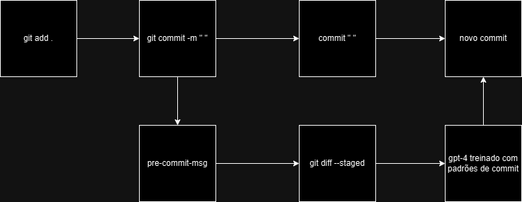

# ai-commit-hooks
Analisando commits com o ChatGPT

### Padrões de Commit

A base do prompt usada é explorada aqui em [iuricode/padroes-de-commit](https://github.com/iuricode/padroes-de-commits).

> _De acordo com a documentação do Conventional Commits, commits semânticos são uma convenção simples para ser utilizada nas mensagens de commit. Essa convenção define um conjunto de regras para criar um histórico de commit explícito, o que facilita a criação de ferramentas automatizadas._

### Pré-requisitos

- Python 3
- Git/Git Bash
- Chave de API da Open AI

### Como configurar

1. Crie um ambiente vitual e instale a dependência da OpenAI;
```shell
python -m venv env
```

```shell
.\env\Scripts\Activate # windows
```

```bash
env/bin/activate # linux
```

```shell
pip install openai
```

2. Adicione sua chave da OpenAI como variável de ambiente `OPENAI_API_KEY` e;

3. Adicione o arquivo `prepare-commit-msg` no diretório oculto `.git/hooks/`.

```bash
#!/bin/sh
COMMIT_MSG_FILE=$1

OS=$(uname -o)
WINDOWS="Msys"

if [ "$OS" = "$WINDOWS" ]; then
    env/scripts/python prepare_commit_msg_ai.py
else
    env/bin/python prepare_commit_msg_ai.py
fi

cat "$COMMIT_MSG_FILE" >> temp_msg
mv temp_msg "$COMMIT_MSG_FILE"
COMMIT_MSG=$(cat "$COMMIT_MSG_FILE")
if [[ -z "$COMMIT_MSG" || "$COMMIT_MSG" =~ ^[[:space:]]*$ ]]; then
    exit 1 # erro: mensagem vazia
fi
```

### Como isso funciona



**OBS**: no vscode é possível stagear as alterações sem utilizar diretamente `git add`. Este por sua vez, é acionado por trás dos panos.

### Features (em breve)

**Retirar acoplamento ao Python**

1. Trabalhar com outros tipos de contrato que podem passados para a chamada via curl;
2. Construir um tratamento de texto do `git diff` (pode se mostrar bastante complexo), sem utilizar utilitários como o `jq`;
